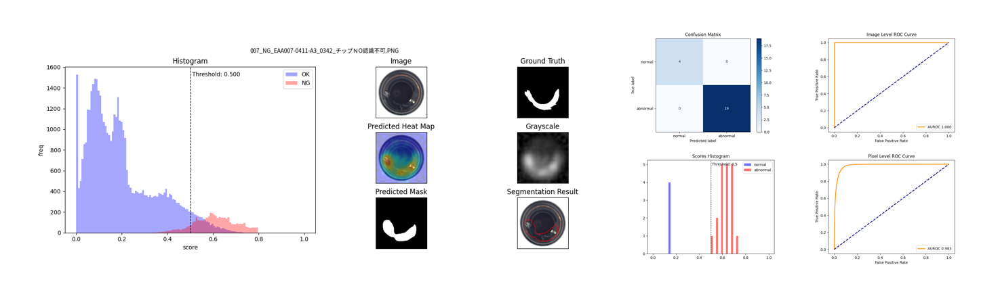
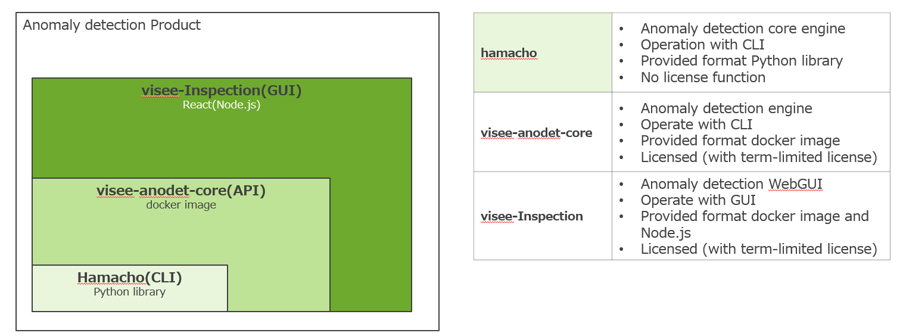
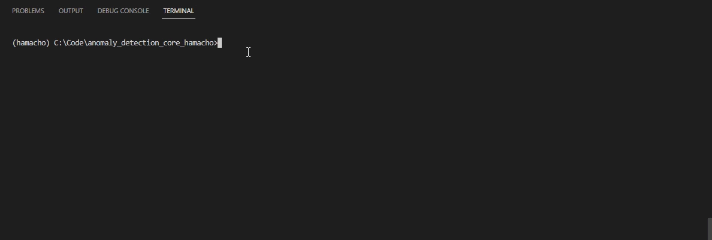
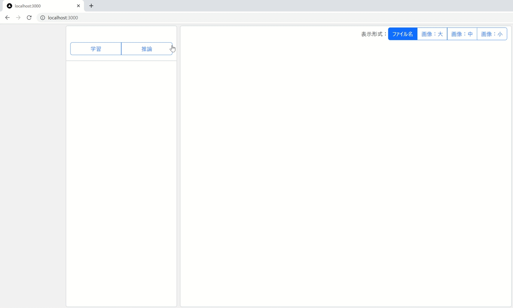

[**Japanese**](README.md)

[]()
[]()
[]()
[]()


# Anomaly Detection Core (hamacho)

Anomaly detection product. It was developed to streamline in-house PoC.
By preparing a small amount of good and abnormal images, analysis report outputs is generated in image format.
   

We also provide custom offerings based on this library to meet customer requirements.

## Formats provided
Three types of formats are available.
1. CLI (provided by Python library) 
2. API (provided by Docker with term-limited license) 
3. GUI (API of #2 wrapped in React with term-limited license)

   

### How it works
  #### CLI
   

  #### WebGUI
   


# Table of Contents
 [Requirements](#requirements) | [Quick start guide](#quick-start-guide) | [Development material](#develop-material) |[PR rules](#pr-rules-are-defined--described) | [Development technology stack](#dev-stacks)

# Requirement

- Ubuntu 20.04 & 22.04 or Windows 10 & Windows 11
- Python 3.8.*
- PyTorch 1.12.1
- torchvision 0.13.1
- [CUDA Toolkit 11.3](https://developer.nvidia.com/cuda-11.3.0-download-archive) - for training on GPU
- Nvidia Driver and Docker with WSL 2


  
******************

# Quick Start Guide

For information on how to use the Python Library, API, and WebGUI,  [here](./docs/quickstart/quickstart.md)

# Detailed Documentation

　For more information, see the [documentation](./docs/index.md).


## Example of learning and reasoning from environment setup on Windows
Assume that Docker Desktop is installed.
1. [running in a docker environment](#running-in-a-docker-environment-using-a-multi-stage-build)
2. [data preparation](#data-preparation)
3. [startup](#startup) 
4. [train](#train)
5. [inference](#inference)

### Running in a Docker environment (using a multi-stage build)
```sh
git clone https://github.com/chowagiken/anomaly_detection_core_hamacho.git
cd anomaly_detection_core_hamacho
. /docker/build_image.sh # Select 'dev' from the options
```

### Data Preparation

- [here](https://chowagiken.sharepoint.com/CorporatePlanning/licence-business/Shared%20Documents/Forms/AllItems.aspx?newTargetListUrl=%2FCorporatePlanning%2Flicence%2Dbusiness%2FShared%20Documents&viewpath=%2FCorporatePlanning%2Flicence%2Dbusiness%2FShared%20Documents%2FForms%2FAllItems%2Easpx&id=%2FCorporatePlanning%2Flicence%2Dbusiness%2FShared%20Documents%2F02%5F%E7%95%B0%E5%B8%B8%E6%A4%9C%E7%9F%A5%5FAnomalyDetection%2F04%5F%E3%83%97%E3%83%AD%E3%83%80%E3%82%AF%E3%83%88%E9%96%8B%E7%99%BA%5FDevelopment%2F01%5F%E8%A9%95%E4%BE%A1%E7%94%A8%E3%83%87%E3%83%BC%E3%82%BF%E3%82%BB%E3%83%83%E3%83%88%2F%E5%95%86%E7%94%A8NG%EF%BC%89mvtec%5Fbottle&viewid=d90a7d83%2Dbcee%2D4d76%2D8485%2D0947a8795bdc) to download a sample data set (bottel-sealing-surface)
(MVTec's bottel-sealing-surface is a thinned version of MVTec's bottel data)

Prepare a data set with the following structure

```
C:
│ 
└── visee-anodet
    ├── data
    │   └──bottel
    │       ├── good
    │       │    └── [SOME GOOD IMAGE]
    │       ├── bad
    │       │    └── [SOME BAD IMAGE]
    │       └── mask [optional]
    │            └── [SOME MASK LABEL IMAGE W.R.T BAD IMAGE]
    └── license
         └── license.lic
```

### Startup
Start the docker container. This time, we are writing under the assumption that the data and output results will be mounted.
```sh
docker run -v C:\visee-anodet\data:/data -v C:\visee-anodet\results:/resutls -v C:\visee-anodet\license:/license -it --name hmc-test hamacho:prod
```

#### docker command reference
> docker run -v [file path to mount]:[container path] -it hamacho:prod
>* Full path for Windows, relative path for Linux and Mac

How to copy data to a container  
docker cp can be used to copy data into container if the required folder was not mounted.
> docker cp [destination file path] [container id]:[file path to copy]
```sh
$ docker cp C:\visee-anodet\data hmc-test:/app/
```
How to process data in a container and then extract it locally.
> docker cp [container id]:[file path to copy] [destination file path].
```sh
$ docker cp hmc-test:/app/results C:\visee-anodet\data
```

### Train
Generates an abnormality detection model using normal and abnormal images. Evaluation is also performed using the generated model. The training model and evaluation result images are output to the **results** folder below.
This time, the model is called "PatchCore" and is configured to output anomaly regions as masks.

- Learning Commands
```sh
python hamacho/main.py train --with-mask-label \
                             --task-type segmentation \
                             --model patchcore \
                             --category bottle-sealing-surface
```

#### Output after learning
After the study, images and csv files will be output in the following folder structure.

Combined output results (graphs such as AUROC on the right side are output in a separate file)
! [image](https://user-images.githubusercontent.com/110383823/203926830-5fd6241d-d749-4fbb-80cb-18c8ac49957a.png)

```
C:
│ 
└── visee-anodet
    ├── data
    │   └──bottel-sealing-surface
    │       ├── good
    │       │    └── [SOME GOOD IMAGE]
    │       ├── bad
    │       │    └── [SOME BAD IMAGE]
    │       └── mask [optional]
    │            └── [SOME MASK LABEL IMAGE W.R.T BAD IMAGE]
    └── results
        └── bottel-sealing-surface
            └── patchcore
                ├── test_predictions
                │   │
                │   ├── images
                │   │   ├── combined(histgram and result images)
                │   │   │   └── [SOME RESULT IMAGE]
                │   │   ├── grayscale(Image score per pixel)
                │   │   │   └── [SOME RESULT IMAGE]
                │   │   ├── predicted_heat_map(Show anomaly)
                │   │   │   └── [SOME RESULT IMAGE]
                │   │   └── predicted_mask(Mask GrayScale image)
                │   │       └── [SOME RESULT IMAGE]
                │   │       
                │   ├── csv(Image score text per pixel)
                │   │       └── [SOME RESULT csv file]
                │   │
                │   └── metrics(AUROC,confusion_matrix,image-level-roc,etc)
                │           └── [SOME RESULT IMAGE and csv file]
                │           
                ├── weights
                │   └── trained_data.hmc
                │          
                └── config.yaml

```

The pixel Level output is displayed only when the with-mask-label (default False) option is enabled.
The closer each value is to 1.0, the higher the accuracy.

|     |  Test metric  | DataLoader 0       |
| --- | :-----------: | :------------------: |
||     Image Level AUROC       |          1.0|
||Image Level BinaryAccuracy   |  0.9848484992980957|
||Image Level BinaryPrecision  |          1.0|
|| Image Level BinaryRecall    |  0.9841269850730896|
||    Image Level F1Score      |          1.0|
||     Pixel Level AUROC       |  0.9528321623802185|
||Pixel Level BinaryAccuracy   |  0.9129900336265564|
||Pixel Level BinaryPrecision  |  0.4540739953517914|
|| Pixel Level BinaryRecall    |  0.9793243408203125|
||    Pixel Level F1Score      |  0.6204635500907898|

************

#### Learning mode with normal products only (no-bad-mode)
You can use the following commands to learn and evaluate only normal products.
`--no-bad-mode`.

- [here](https://chowagiken.sharepoint.com/CorporatePlanning/licence-business/Shared%20Documents/Forms/AllItems.aspx?newTargetListUrl=%2FCorporatePlanning%2Flicence%2Dbusiness%2FShared%20Documents&viewpath=%2FCorporatePlanning%2Flicence%2Dbusiness%2FShared%20Documents%2FForms%2FAllItems%2Easpx&id=%2FCorporatePlanning%2Flicence%2Dbusiness%2FShared%20Documents%2F02%5F%E7%95%B0%E5%B8%B8%E6%A4%9C%E7%9F%A5%5FAnomalyDetection%2F04%5F%E3%83%97%E3%83%AD%E3%83%80%E3%82%AF%E3%83%88%E9%96%8B%E7%99%BA%5FDevelopment%2F01%5F%E8%A9%95%E4%BE%A1%E7%94%A8%E3%83%87%E3%83%BC%E3%82%BF%E3%82%BB%E3%83%83%E3%83%88%2F%E5%95%86%E7%94%A8NG%EF%BC%89mvtec%5Fbottle&viewid=d90a7d83%2Dbcee%2D4d76%2D8485%2D0947a8795bdc)Download the following data. 

```
  data
  └── bottel-with-no-bad
      │
      └── good
          └── [SOME GOOD IMAGE]
```
- Train Commands:

```sh 
$ python hamacho/main.py train --task-type segmentation --model patchcore --category bottle-with-no-bad --no-bad-mode
```


### Inference
*****
Inference is performed by inputting an arbitrary image and outputting the percentage of anomaly for that image (100% is anomaly) and the ImageScore of the inferred image.

*****

- Segmentation output results


- Classification output results (ImageScore<0.5 is normal)


Folder structure:
```
C:
│ 
└── visee-anodet
    ├── data
    │   └──bottel-sealing-surface
    │       ├── good
    │       │    └── [SOME GOOD IMAGE]
    │       ├── bad
    │       │    └── [SOME BAD IMAGE]
    │       └── mask [optional]
    │            └── [SOME MASK LABEL IMAGE W.R.T BAD IMAGE]
    └── results
        └── bottel-sealing-surface
            └── patchcore
                └── inference
                    │
                    ├── images
                    │   ├── combined(histgram and result images)
                    │   │        └── image-path name
                    │   │             └── [SOME RESULT IMAGE]
                    │   │   
                    │   ├── grayscale(Image score per pixel)
                    │   │        └── image-path name
                    │   │             └── [SOME RESULT IMAGE]
                    │   │   
                    │   ├── predicted_heat_map(Show anomaly)
                    │   │        └── image-path name
                    │   │             └── [SOME RESULT IMAGE]
                    │   │   
                    │   └── predicted_mask(Mask GrayScale image)
                    │            └── image-path name
                    │                 └── [SOME RESULT IMAGE]
                    │       
                    ├── csv(Image score text per pixel)
                    │       └── [SOME RESULT csv file]
                    │
                    └── metrics(Predict result,Predict file name...etc )
                            └── test_outputs.csv

```

There are two options for inference.
- [infer one file](#commands-to-infer-a-single-piece-of-data)
- [infer all images in a folder](#command-to-infer-all-images-in-the--folder)

#### Commands to infer a single piece of data.
```sh
python hamacho/main.py inference \
       --image-path "data/bottle-sealing-surface/000.png" \
       --config-path ". /results/bottle-sealing-surface/patchcore/config.yaml" 
```

#### Command to infer all images in the #### folder.
```sh
python hamacho/main.py inference \
      --image-path "data/bottle-sealing-surface/bad" \
      --config-path "results/bottle-sealing-surface/patchcore/config.yaml"
```

#### Change Threshold (Control Threshold)
The default value of the image threshold (image_norm) is 0.5 or less for normal and 0.5 or more for abnormal.
The following parameters are included in config.yaml, and can be adjusted later to change the normal/abnormal threshold value.

In the case of segmentation, the mask value can be changed by controlling the threshold value (pixel_norm) of each pixel.

```yaml
  threshold:                    threshold:
    image_norm: 0.5       →       image_norm: 0.5
    pixel_norm: 0.5       →       pixel_norm: 0.9
    image_default: 0      →       image_default: 0
    pixel_default: 0      →       pixel_default: 0
    adaptive: true        →       adaptive: true
```


---


# Develop material

[Develop material](https://chowagiken.sharepoint.com/CorporatePlanning/licence-business/SitePages/Anomaly-Detection-Product.aspx)


# PR rules are defined & described
Please follow the rules to merge PR.
1. MERGE is OK if any one of the reviewer gives OK permission.
2. MERGE can be done by the person only that submits the PR.
3. Always include test code in PullRequest
	- For reviewers, having test code helps them better understand the code
	- For tasks such as research, surveys, etc., it is not necessary to include it
	- Since the test code should be included at least at the time of review, the approach is to not write test code while you are developing, and to create tests at the end before submitting the PR

Example:
- Member-A submits PR  
- Review request to Reviewer-1, Reviewer-2, Reviewer-3  
- Reviewer-2 approves.  
- Member-A will merge.

Target reviewer:  
If the content is related to the product or product design, include reviewers (Mr. Nakata, Taku Suzuki) from JP side.  
Minor bugs can be reviewed and merged among ASJ members.

---

# Dev stacks

Basically, follow below page.
If you need to make changes, describe it in this README.

[Tech Stacks](https://chowagiken.sharepoint.com/RD/SitePages/%E6%A8%99%E6%BA%96%E6%8A%80%E8%A1%93%E3%82%B9%E3%82%BF%E3%83%83%E3%82%AF.aspx?source=https%3A%2F%2Fchowagiken.sharepoint.com%2FRD%2FSitePages%2FForms%2FAllPages.aspx)
