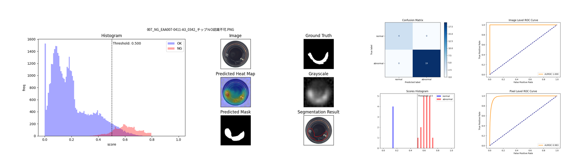
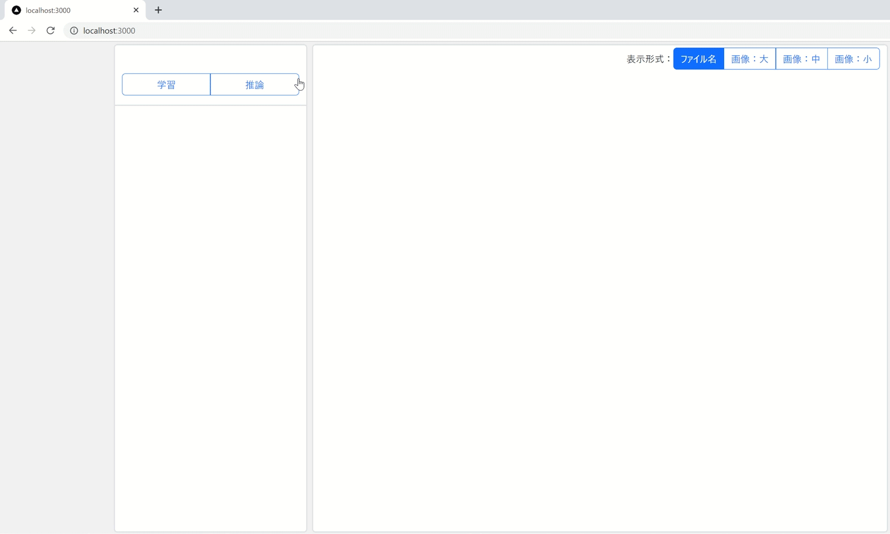

[**English**](README.en.md)

[]()
[]()
[]()
[]()


# Anomaly Detection Core (hamacho)


異常検知のプロダクトです。社内のPoCを効率化するために開発されました。  
少量の良品画像・異常画像を準備すれば、分析レポート用の画像を出力することができます。  
   

また、このライブラリをベースに顧客要望に合わせてカスタム提供します。

## 提供形式
3種類の形式で準備しています。
1. CLI　(Python libraryによる提供形式)
2. API　(Docker による提供形式　期限付きライセンス機能あり)
3. GUI　(2のAPIをReactでラップした提供形式　期限付きライセンス機能あり)  


### 動作イメージ
  #### CLI
   

  #### WebGUI
   


# 目次
 [要件](#要件)  | [Quick start guide](#quick-start-guide) |  [開発関連ドキュメント](#開発関連ドキュメント)|[プルリクエストのルール](#プルリクエストのルール)|[開発技術スタック](#開発技術スタック)

# 要件

- Ubuntu 20.04 & 22.04 or Windows10 & Windows11
- Python 3.8.*
- PyTorch 1.12.1
- torchvision 0.13.1
- [CUDA Toolkit 11.3](https://developer.nvidia.com/cuda-11.3.0-download-archive) - for training on GPU  
- Nvidia Driver and Docker with WSL 2
  
******************

# Quick Start Guide

 　Python LibraryやAPI,WebGUIの使用方法はここを[クリック](./docs/quickstart/quickstart.jp.md)


# 詳細な資料

　詳細については、[ドキュメント](./docs/index.jp.md)を参照してください。

## Windowsでの環境構築から学習・推論の例
Docker Desktopがインストールされている前提とします。
1. [Docker環境構築で動かす場合](#docker環境で動かす場合マルチステージビルドを採用)
2. [データの準備](#データの準備)
3. [Docker起動](#起動)
4. [Train(学習)](#train学習)
5. [Inference(推論)](#inference推論)

### Docker環境で動かす場合（マルチステージビルドを採用）
```sh
git clone https://github.com/chowagiken/anomaly_detection_core_hamacho.git
cd anomaly_detection_core_hamacho
./docker/build_image.sh # Select 'dev' from the options
```

### データの準備

- [ここ](https://chowagiken.sharepoint.com/CorporatePlanning/licence-business/Shared%20Documents/Forms/AllItems.aspx?newTargetListUrl=%2FCorporatePlanning%2Flicence%2Dbusiness%2FShared%20Documents&viewpath=%2FCorporatePlanning%2Flicence%2Dbusiness%2FShared%20Documents%2FForms%2FAllItems%2Easpx&id=%2FCorporatePlanning%2Flicence%2Dbusiness%2FShared%20Documents%2F02%5F%E7%95%B0%E5%B8%B8%E6%A4%9C%E7%9F%A5%5FAnomalyDetection%2F04%5F%E3%83%97%E3%83%AD%E3%83%80%E3%82%AF%E3%83%88%E9%96%8B%E7%99%BA%5FDevelopment%2F01%5F%E8%A9%95%E4%BE%A1%E7%94%A8%E3%83%87%E3%83%BC%E3%82%BF%E3%82%BB%E3%83%83%E3%83%88%2F%E5%95%86%E7%94%A8NG%EF%BC%89mvtec%5Fbottle&viewid=d90a7d83%2Dbcee%2D4d76%2D8485%2D0947a8795bdc)からサンプルのデータセット(bottel-sealing-surface)をダウンロードしてください  
（MVTecのbottleデータを間引いたものです）

次の構造でデータセットを準備します。

```
C:
│ 
└── visee-anodet
    ├── data
    │   └──bottel
    │       ├── good
    │       │    └── [SOME GOOD IMAGE]
    │       ├── bad
    │       │    └── [SOME BAD IMAGE]
    │       └── mask [optional]
    │            └── [SOME MASK LABEL IMAGE W.R.T BAD IMAGE]
    └── license
         └── license.lic
```

### 起動
dockerコンテナを起動します。今回はデータと出力結果をマウントする前提での書き方です。
```sh
docker run -v C:\visee-anodet\data:/data -v C:\visee-anodet\results:/resutls -v C:\visee-anodet\license:/license -it --name hmc-test hamacho:prod
```

#### docker commandの参考
> docker run -v [マウントしたいファイルパス]:[コンテナのパス] -it hamacho:prod  
>※ `Windows`はフルパス、`Linux`、`Mac`は相対パス

コンテナにデータをコピーする方法

> docker cp [コピー先のファイルパス] [コンテナID]:[コピーするファイルパス]
```sh
$ docker cp C:\visee-anodet\data hmc-test:/app/ 
```
コンテナでデータを処理し、その後ローカルに抜き出す方法
> docker cp [コンテナID]:[コピーするファイルパス] [コピー先のファイルパス]
```sh
$ docker cp hmc-test:/app/results C:\visee-anodet\data
```

### Train(学習)
正常・異常画像を使って異常検知モデルを生成します。また同時に生成したモデルを使って評価も同時実行します。  
学習モデルと評価結果画像は以下の`results`フォルダに出力されます。  
今回はPatchCoreというモデルで異常領域をマスクで出力する設定で実行します。

- 学習コマンド
```sh
python hamacho/main.py train --with-mask-label \
                             --task-type segmentation \
                             --model patchcore \
                             --category bottle-sealing-surface
```

#### 学習後の出力  
学習後は以下のフォルダ構成で画像や`csv`ファイルが出力されます。

`combined`の出力結果（右側のAUROCなどのグラフは別ファイルで出力されます）


```
C:
│ 
└── visee-anodet
    ├── data
    │   └──bottel-sealing-surface
    │       ├── good
    │       │    └── [SOME GOOD IMAGE]
    │       ├── bad
    │       │    └── [SOME BAD IMAGE]
    │       └── mask [optional]
    │            └── [SOME MASK LABEL IMAGE W.R.T BAD IMAGE]
    └── results
        └── bottel-sealing-surface
            └── patchcore
                ├── test_predictions
                │   │
                │   ├── images
                │   │   ├── combined(histgram and result images)
                │   │   │   └── [SOME RESULT IMAGE]
                │   │   ├── grayscale(Image score per pixel)
                │   │   │   └── [SOME RESULT IMAGE]
                │   │   ├── predicted_heat_map(Show anomaly)
                │   │   │   └── [SOME RESULT IMAGE]
                │   │   └── predicted_mask(Mask GrayScale image)
                │   │       └── [SOME RESULT IMAGE]
                │   │       
                │   ├── csv(Image score text per pixel)
                │   │       └── [SOME RESULT csv file]
                │   │
                │   └── metrics(AUROC,confusion_matrix,image-level-roc,etc)
                │           └── [SOME RESULT IMAGE and csv file]
                │           
                ├── weights
                │   └── trained_data.hmc
                │          
                └── config.yaml

```

`pixel Level`の出力は`with-mask-label`(default False)オプションが有効の時のみ表示されます。  
各数値が1.0に近いほど精度が高いと考えてください。

|     |  Test metric  | DataLoader 0       |
| --- | :-----------: | :------------------: |
||     Image Level AUROC       |          1.0|
||Image Level BinaryAccuracy   |  0.9848484992980957|
||Image Level BinaryPrecision  |          1.0|
|| Image Level BinaryRecall    |  0.9841269850730896|
||    Image Level F1Score      |          1.0|
||     Pixel Level AUROC       |  0.9528321623802185|
||Pixel Level BinaryAccuracy   |  0.9129900336265564|
||Pixel Level BinaryPrecision  |  0.4540739953517914|
|| Pixel Level BinaryRecall    |  0.9793243408203125|
||    Pixel Level F1Score      |  0.6204635500907898|

************

#### 正常品のみでの学習モード(no-bad-mode)
次のコマンドをつけることで、正常品のみでも学習・評価をすることが可能です。  
`--no-bad-mode` 

- [ここ](https://chowagiken.sharepoint.com/CorporatePlanning/licence-business/Shared%20Documents/Forms/AllItems.aspx?newTargetListUrl=%2FCorporatePlanning%2Flicence%2Dbusiness%2FShared%20Documents&viewpath=%2FCorporatePlanning%2Flicence%2Dbusiness%2FShared%20Documents%2FForms%2FAllItems%2Easpx&id=%2FCorporatePlanning%2Flicence%2Dbusiness%2FShared%20Documents%2F02%5F%E7%95%B0%E5%B8%B8%E6%A4%9C%E7%9F%A5%5FAnomalyDetection%2F04%5F%E3%83%97%E3%83%AD%E3%83%80%E3%82%AF%E3%83%88%E9%96%8B%E7%99%BA%5FDevelopment%2F01%5F%E8%A9%95%E4%BE%A1%E7%94%A8%E3%83%87%E3%83%BC%E3%82%BF%E3%82%BB%E3%83%83%E3%83%88%2F%E5%95%86%E7%94%A8NG%EF%BC%89mvtec%5Fbottle&viewid=d90a7d83%2Dbcee%2D4d76%2D8485%2D0947a8795bdc)のデータをダウンロードしてください。:
  ```
  data
  └── bottel-with-no-bad
      │
      └── good
          └── [SOME GOOD IMAGE]
  ```
- 学習コマンド:
 ```sh
 python hamacho/main.py train --task-type segmentation --model patchcore --category bottle-with-no-bad --no-bad-mode
 ```


### Inference(推論)
*****
推論は任意の画像を入力すると、その画像に対しての異常度のパーセンテージ（100％が異常）と推論した画像の`ImageScore`が出力されます。

*****

- セグメンテーションの出力結果


- 分類の出力結果　（ImageScore<0.5が正常）


```
C:
│ 
└── visee-anodet
    ├── data
    │   └──bottel-sealing-surface
    │       ├── good
    │       │    └── [SOME GOOD IMAGE]
    │       ├── bad
    │       │    └── [SOME BAD IMAGE]
    │       └── mask [optional]
    │            └── [SOME MASK LABEL IMAGE W.R.T BAD IMAGE]
    └── results
        └── bottel-sealing-surface
            └── patchcore
                └── inference
                    │
                    ├── images
                    │   ├── combined(histgram and result images)
                    │   │        └── image-path name
                    │   │             └── [SOME RESULT IMAGE]
                    │   │   
                    │   ├── grayscale(Image score per pixel)
                    │   │        └── image-path name
                    │   │             └── [SOME RESULT IMAGE]
                    │   │   
                    │   ├── predicted_heat_map(Show anomaly)
                    │   │        └── image-path name
                    │   │             └── [SOME RESULT IMAGE]
                    │   │   
                    │   └── predicted_mask(Mask GrayScale image)
                    │            └── image-path name
                    │                 └── [SOME RESULT IMAGE]
                    │       
                    ├── csv(Image score text per pixel)
                    │       └── [SOME RESULT csv file]
                    │
                    └── metrics(Predict result,Predict file name...etc )
                            └── test_outputs.csv

```

推論は２つのオプションがあります。
- [ファイル1つを推論](#1つのデータを推論するコマンド)  
- [フォルダ内の画像を全て推論](#フォルダ内の画像を全て推論するコマンド)  


#### 1つのデータを推論するコマンド
```sh
python hamacho/main.py inference \
       --image-path "data/bottle-sealing-surface/000.png" \
       --config-path "./results/bottle-sealing-surface/patchcore/config.yaml" \
```
#### フォルダ内の画像を全て推論するコマンド
```sh
python hamacho/main.py inference \
      --image-path "data/bottle-sealing-surface/bad" \
      --config-path "results/bottle-sealing-surface/patchcore/config.yaml"
```

#### 閾値の変更(Control Threshold)
画像に対しての閾値(`image_norm`)はdefault値は0.5より小さいと正常、0.5以上を異常としている。  
`config.yaml`内に以下のパラメータがあり、ここを調整することで正常・異常の閾値をあとから変更することができる。  

`segmentation`の場合は各画素の閾値(`pixel_norm`)をコントロールすることでマスクの値を変更することが可能。  

```yaml
  threshold:                    threshold:
    image_norm: 0.5       →       image_norm: 0.5
    pixel_norm: 0.5       →       pixel_norm: 0.9
    image_default: 0      →       image_default: 0
    pixel_default: 0      →       pixel_default: 0
    adaptive: true        →       adaptive: true
```


---


# 開発関連ドキュメント

[開発関連ドキュメント](https://chowagiken.sharepoint.com/CorporatePlanning/licence-business/SitePages/Anomaly-Detection-Product.aspx)

# プルリクエストのルール
PR後のマージは以下のルールに従う。
1. PR後、レビュアーのうち、１人が許可を出したらマージOKとする。
2. マージする人はPR を出した人とする。
3. PR には必ずテストコードを含める
	- レビュアーにとって、テストコードがあるとコードへの理解が深まる
	- 研究・調査タスクの場合は含めなくてもよい
	- 少なくともレビュー時にテストコードがあればよいので、最初からテストを書かずにPR発行前にテストコードを書いてもよい。


例）
- メンバーAがPRを出す　→　レビュアー1、レビュアー2、レビュアー3
- レビュアー2がapproveした。
- メンバーAがマージする

レビュアー対象者:  
プロダクトや製品のデザインに関わる内容なら日本側のレビュアーを入れる（中田さん、鈴木卓）  
軽微なバグならASJメンバー内でレビュー・マージしてもよい。（その際なんのバグを修正したかはJiraで共有してほしい）  

---

# 開発技術スタック

基本的には以下のページに従う。
変更が必要な場合はここへ記載する。

[Tech Stacks](https://chowagiken.sharepoint.com/RD/SitePages/%E6%A8%99%E6%BA%96%E6%8A%80%E8%A1%93%E3%82%B9%E3%82%BF%E3%83%83%E3%82%AF.aspx?source=https%3A%2F%2Fchowagiken.sharepoint.com%2FRD%2FSitePages%2FForms%2FAllPages.aspx)
