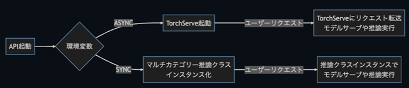

# 本番環境へのデプロイ

## Cythonによる共有ライブラリ化とコンテナイメージ作成
```
(リポジトリルートで)
./docker/build_image.sh     # <-- select prod-api-obfuscated
```

## 開発・テスト環境向け
```
./docker/build_image.sh     # <-- select api or api-test
```

次のようなデータ構造を準備する
```
C:
│ 
└── visee-anodet
    ├── data
    │   └──bottel
    │       ├── good
    │       │    └── [SOME GOOD IMAGE]
    │       ├── bad
    │       │    └── [SOME BAD IMAGE]
    │       └── mask [optional]
    │            └── [SOME MASK LABEL IMAGE W.R.T BAD IMAGE]
    └── license
         └── license.lic
```


## コンテナ起動
WindowsからAPIを利用する場合の例 (WSLで実行)
```sh
docker run --name hamacho --gpus all \
-e HOST_DATA_DIR=C:\\\\visee-anodet\\\\data \
-e BASE_DATA_DIR=/data \ 
-e DBPATH=/app/hamacho_db.sqlite \
-e PREDICTION_MODE=SYNC \
-e PORT=5000 \
-v /mnt/c/visee-anodet/data:/data \
-v /mnt/c/visee-anodet/license:/license \
-v /mnt/c/visee-anodet/results:/app/results/ \
-p 5000:5000 \
hamacho:v1.4.0-prod-api-obfuscated
```

開発環境ではこちらの環境変数が必要`-e OBFUSCATED_VERIFIER_DUMMY_DIR`と`PYARMOR_LICENSE=/app/license/license.lic`

```sh
docker run --name hamacho --gpus all \
-e HOST_DATA_DIR=C:\\\\visee-anodet\\\\data \
-e BASE_DATA_DIR=/data \ 
-e DBPATH=/app/hamacho_db.sqlite \
-e PREDICTION_MODE=SYNC \
-e PORT=5000 \
-v /mnt/c/visee-anodet/data:/data \
-v /mnt/c/visee-anodet/license:/license \
-v /mnt/c/visee-anodet/results:/app/results/ \
-e OBFUSCATED_VERIFIER_DUMMY_DIR=/app/api/util \
-e PYARMOR_LICENSE=/app/license/license.lic \
-p 5000:5000 \
hamacho:v1.4.0-api
```

WSLからAPIを利用する場合の例 (WSLで実行)
```sh
docker run --name hamacho --gpus all \
-e HOST_DATA_DIR=/mnt/c/visee-anodet/data \
-e BASE_DATA_DIR=/data \
-e DBPATH=/app/hamacho_db.sqlite \
-e PREDICTION_MODE=SYNC  \
-e PORT=5000 \ 
-v /mnt/c/visee-anodet/data:/data \
-v /mnt/c/visee-anodet/license:/license \
-v /mnt/c/visee-anodet/results:/app/results/ \
-p 5000:5000 \ 
hamacho:v1.4.0-prod-api-obfuscated
```

Windows docker desktopを利用する場合の例
```sh
docker run --name hamacho --gpus all \
-e HOST_DATA_DIR=C:\\\\visee-anodet\\\\data \
-e BASE_DATA_DIR=/data \
-e DBPATH=/app/hamacho_db.sqlite \
-e PREDICTION_MODE=SYNC \
-e PORT=5000 \
-v C:\\Users\\visee-anodet\\data:/data \
-v C:\\visee-anodet\\license:/license \
-v C:\\visee-anodet\\results:/app/results/ \
-p 5000:5000 \
hamacho:v1.4.0-prod-api-obfuscated
```

ポートは8080や8081, 8082などは避ける
> Avoid 8080, 8081, 8082 ports

#### 2度目以降
```
docker start hamacho
```

# 開発環境のセットアップ
## 依存パッケージのインストール
```
pip install -r api/requirements.txt
```
## 環境変数
<table>
<tr><td>HOST_DATA_DIR</td><td>ホスト側の基準データディレクトリ</td></tr>
<tr><td>BASE_DATA_DIR</td><td>ホスト側の基準データディレクトリに対応するコンテナ側の基準データディレクトリ</td></tr>
<tr><td>DBPATH</td><td>sqlite3データベースファイルのパス</br>例: /tmp/anomary_db.sqlite</td></tr>
<tr><td>PREDICTION_MODE</td><td>SYNC または ASYNC<br>
ASYNCはtorchserveでマルチプロセス環境で並行推論<br>
SYNCはメモリーバンク切り替えでメモリーを節約するシングルプロセス推論</td></tr>
</table>

## 起動
poetryやdockerコンテナで環境を作り、環境変数設定の上で以下を実行。
#### 開発
```
python -m api.api
```
#### 本番同等 (一例)
```
gunicorn --workers 4 --bind 0.0.0.0:80 api.api:app
```

## テスト
シングルプロセスとマルチプロセスのテストはいっぺんにできないので、以下のように分けて実行。
```
python -m unittest discover api/tests
python -m unittest discover api/tests/sync
python -m unittest discover api/tests/async
```

## Q&A
- APIで何ができるか（CLIと比較して） 
    - ローカルPCからWeb API呼び出しで利用できる。
    - 事前に重みデータをメモリー上に読み込んで、推論ごとにコールドスタートが発生しないように利用できる。    

- APIで何ができないか（CLIと比較して） 
    - コマンドラインからの学習や推論 (ただしcurlコマンドなど除く) 

- どのような仕組みで動いているか  
  

- ASYNCとSYNCはどのように使い分けるか？ 
    - 推論モードSYNCはメモリー使用量が少ないので、メモリーを節約したい場合に使用する。 
    - 推論モードASYNCはメモリー使用量が多い代わりに、並行処理によ高速に推論する。 
  
- HOST_DATA_DIRは何を参照さればよい？ 
    - ローカル上の画像ファイルの上位ディレクトリ  
     （WindowsとLinuxではパスの書き方が異なるので注意が必要）

- BASE_DATA_DIR_PATHは何を参照さればよい？ 
    - コンテナ内の画像ファイルの上位ディレクトリ 
    - システムはHOST_DATA_DIRを置換したパスを参照する 

- DBPATHで気を付けることは？ 
    - データベースには画像ファイルのパスが含まれるので、パスの一貫性に注意する。 

- 動作スペック記載 
    - GPUなし。 
    - GPUあり。(推奨) 
    - 11th Gen Intel(R) Core(TM) i7以上 (推奨) 
    - 16GBメモリー (推奨) 

詳細は[詳細設計書](https://chowagiken.sharepoint.com/CorporatePlanning/licence-business/_layouts/15/Doc.aspx?sourcedoc=%7B573E175E-C321-4151-94F0-C15DD200D54F%7D&file=%E7%95%B0%E5%B8%B8%E6%A4%9C%E7%9F%A5AI%E3%82%B7%E3%82%B9%E3%83%86%E3%83%A0%E8%A9%B3%E7%B4%B0%E8%A8%AD%E8%A8%88%E6%9B%B8.docx&action=default&mobileredirect=true)を参照

-------------------------------------------------------
## Pythonによるコードサンプル

```python
"""
hamachoが動く環境で
$ pip install -r api/requirements.txt
$ HOST_DATA_DIR=/<parentpath>/anomaly_detection_core_hamacho BASE_DATA_DIR=/app DBPATH=/tmp/anomaly_db.sqlite PREDICTION_MODE=SYNC python -m api.api
でサーバー起動
別のターミナルで以下を実行。
data/bottle/ 以下にデータがある前提。
$ python demorun.py
"""

import requests
from pathlib import Path
import json

host = "http://localhost:5000/"

good = []
for p in Path("data/bottle/good").glob("*.png"):
    good.append(str(p.absolute()))

bad = []
for p in Path("data/bottle/bad").glob("*.png"):
    bad.append(str(p.absolute()))

res = requests.post(
    f"{host}/addimage",
    json={"image_tag": "bottle", "image_path": good[:-2], "group": "good"},
    headers={"content-type": "application/json; charset=cp932"},
)
print("image_id:", res.json())

res = requests.get(f"{host}/listimages?tag=bottle")
print("images:", res.json())

res = requests.get(f"{host}/imagedetails?image_tag=bottle")
print("image details:", res.json())

res = requests.post(
    f"{host}/train",
    json={
        "image_tag": "bottle",
        "model_tag": "bottle",
    },
)
model_id = res.json()
print("model_id:", model_id)

res = requests.get(f"{host}/listmodels")
print("models:", res.json())

res = requests.get(f"{host}/modeldetails")
print("models:", res.json())


res = requests.post(f"{host}/servemodel", json={
        "tag": "bottle",
        "mode": "batch",
        "parameters": {
            "project": {
                "save_outputs": {
                    "image": {
                        "classification": ["input_image", "prediction"]
                    },
                    "inference": {
                        "csv": ["anomaly_map", "metrics"]
                    }
                }
            }
        }
    })

res = requests.post(    
    f"{host}/predict", json={"tag": "bottle", "image_paths": good[-2:] + bad[-2:], "save": "all" }
)
print("result:", res.json())

files = [('json', (None, json.dumps({"tag": "bottle", "save": "all"}), "application/json"))]
for im_path in good[-2:] + bad[-2:]:
    filename = Path(im_path).name
    with open(im_path, 'rb') as im:
        files.append(('images', (filename, im.read())))

res =  requests.post("http://localhost:5000/predict?as_file=true", files=files)
print("result with ?as_file=true", res.json())

# list all results
res = requests.get(f"{host}/listresults")
print("all listresults:", res.json())

# list only online mode results of specific model
res = requests.get(f"{host}/listresults?model_id={model_id}&inference_mode=online")
print("online listresults:", res.json())

res = requests.delete(f"{host}/unservemodel?tag=bottle")
print("unserve", res.json())

```