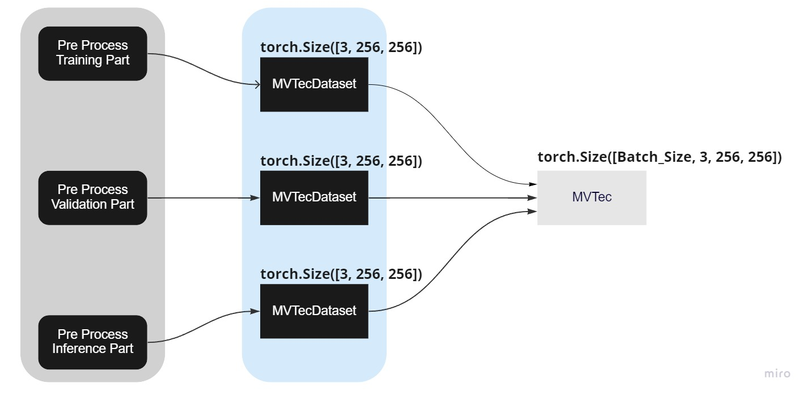

# データセットの管理

Hamacho は現在、**mvtec**、**フォルダー**、および**ファイルリスト形式**の 3 つのデータ形式をサポートしています。 ここでは、それらを管理し、適切な使用方法で構造化する方法を説明します。

これらのドキュメントは、特に焦点を当てて、データ モジュールのメカニズムを示しています。

- MVTec AD
- フォルダモジュール
- ファイルリストモジュール

## 各種データフォーマット

### MVTec フォーマット
```
data
└── <product category>
    │
    ├── train
    │   └── good
    │       └── [SOME GOOD IMAGE]
    ├── test
    │   ├── good
    │   │   └── [SOME GODD IMAGE]
    │   └── bad
    │       └── [SOME BAD IMAGE / SUB-FOLDER]
    └── ground_truth [optional]
        └── [SOME MASK LABEL IMAGE W.R.T BAD IMAGE / SUB-FOLDER]
```
### フォルダフォーマット

```
data
└── <product category>
    │
    ├── good
    │   └── [SOME GOOD IMAGE]
    ├── bad
    │   └── [SOME BAD IMAGE ]
    └── mask [optional]
        └── [SOME MASK LABEL IMAGE W.R.T BAD IMAGE ]
```

### ファイルリスト形式
特殊な形式です。 この場合、特定のデータ形式スタイルはありません。 基本的に、これは、画像パスが複数のフォルダーおよび異なる場所に存在する場合のために設計されています。

## 高レベルの概要

高レベルでは、anomalib データ モジュールは次のように 2 つの部分で構成されています。
簡単な詳細については、この[jira チケット](https://chowagiken.atlassian.net/browse/WAD-72?focusedCommentId=17652)と最初の [ppt](https://chowagiken-my.sharepoint.com/:p:/g/personal/mohammed_innat_chowagiken_co_jp/Ef_uowcrhHZPgOuJBKRu-E8B6dlgDoQzfu76lzGCXrNrSw?e=dFbjiA) を参照してください。また、それに関するこの[主要な観察](https://gist.github.com/innat-asj/51ad6fccfcde2953576101c48a3589f5)も参照してください。MVTec データ モジュールの場合、全体的なプロセスは次のレイアウトになります。



1. 各データ収集は `torch Dataset` で実装されます
     1. torch Dataset は `torch.utils.data.Dataset` を継承し、`__len__` および `__getitem__` メソッドを実装します。
     2. 読み取り、単一のイメージに変換します (アンバッチ)。
     3. プライマリ クラス名 (上の図に表示)
         a. 「前処理」
         b. `MVTecDataset`
         
2. 次に、`torch.utils.data.Dataset` が **PyTorch Lighting Module** に渡され、トレーニング、検証、および推論スキームを効率的に活用します。
     1. DataModule 実装は、PyTorch Lightning DataModule オブジェクトを継承します。このクラスの利点は、ダウンロードから Torch データ ローダーの作成までのデータの各ステップを整理できることです。
     2. バッチを作成したり、学習データをシャッフルしたりします。


```python
class PreProcessor:
     return [read_image_data nad resize]

class MVTecDataset(VisionDataset):
     PreProcessor()
     return single torch array [3, 256, 256]

class MVTec(LightningDataModule):
    data = MVTecDataset(**config)
    return batch torch array [batch, 3, 256, 256]

def get_datamodule:
    datamodule = MVTec(
            root=config.dataset.path,
            category=config.dataset.category,
            image_size=(
                      config.dataset.image_size[0], 
                      config.dataset.image_size[1]
            ),
            train_batch_size=config.dataset.train_batch_size,
            test_batch_size=config.dataset.test_batch_size,
            num_workers=config.dataset.num_workers,
            seed=config.project.seed,
            task=config.dataset.task,
            transform_config_train=config.dataset.transform_config.train,
            transform_config_val=config.dataset.transform_config.val,
            create_validation_set=config.dataset.create_validation_set,
        )

config = './patchcoore/config.yaml'
datamodule = get_datamodule(config)
```