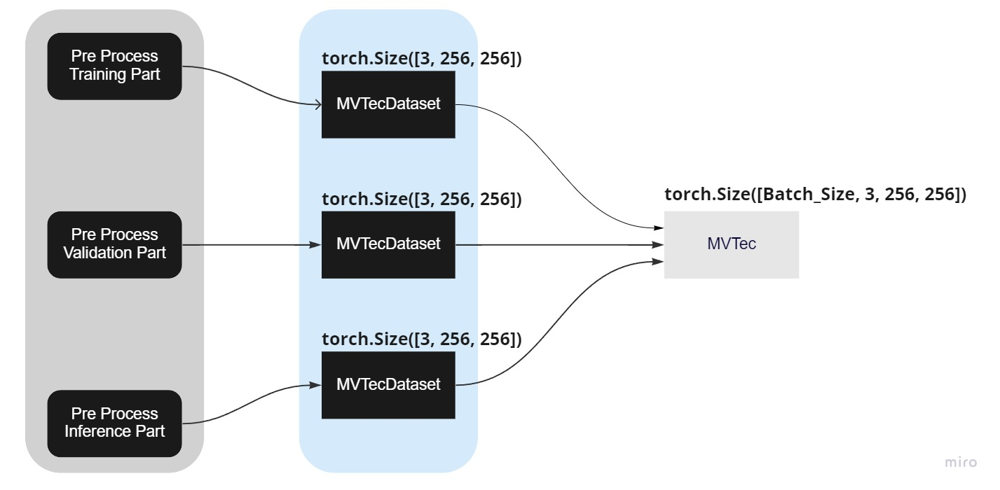

# Manage Dataset

Hamacho currently support 3 type of data format, namely **mvtec**, **folder** and **filelist** format. Here we will see how to manage them and structure them with proper way to use it. These documents demonstrate the mechanism of data modules, with a specific focus on:

- MVTec AD and
- Folder Module
- Filelist Module

## Various Data Formats

### MVTec Format

```bash
data
└── <product category>
    │
    ├── train
    │   └── good
    │       └── [SOME GOOD IMAGE]
    ├── test
    │   ├── good
    │   │   └── [SOME GODD IMAGE]
    │   └── bad
    │       └── [SOME BAD IMAGE / SUB-FOLDER]
    └── ground_truth [optional]
        └── [SOME MASK LABEL IMAGE W.R.T BAD IMAGE / SUB-FOLDER]
```

### Folder Formal 

```bash
data
└── <product category>
    │
    ├── good
    │   └── [SOME GOOD IMAGE]
    ├── bad
    │   └── [SOME BAD IMAGE ]
    └── mask [optional]
        └── [SOME MASK LABEL IMAGE W.R.T BAD IMAGE ]
```

### Filelist format

It is a special format. In this case there is not particular data format style. Basically, this is designed for in a case where image paths are located in multiple folders and different locations.

## High Level Overview

In high level, `hamacho` data modules are structured in 2 parts, as follows. For quick details, see this [jira ticket](https://chowagiken.atlassian.net/browse/WAD-72?focusedCommentId=17652) and [initial ppt](https://chowagiken-my.sharepoint.com/:p:/g/personal/mohammed_innat_chowagiken_co_jp/Ef_uowcrhHZPgOuJBKRu-E8B6dlgDoQzfu76lzGCXrNrSw?e=dFbjiA) for this. Also, see this [primary observation](https://gist.github.com/innat-asj/51ad6fccfcde2953576101c48a3589f5) about it. In case of MVTec data module, the following layout is the overall process.



1. Each data collection is implemented with the `torch Dataset`
    1. The torch Dataset inherits `torch.utils.data.Dataset` and implement the `__len__` and `__getitem__` methods.
    2. It reads and transforms into a single image (unbatch).
    3. Primary Class Name (shown below diagram)
        a. `Pre-Process`
        b. `MVTecDataset`
2. Then `torch.utils.data.Dataset` is passed to the **PyTorch Lighting Module** in order to further leverage training, validation, and inferencing scheme efficiently.
    1. The DataModule implementation inherits the PyTorch Lightning DataModule object. The advantage of this class is that it organizes each step of data from download to creating the Torch data loader.
    2. It creates batch, shuffling the training data, etc.

```python
class PreProcessor:
     return [read_image_data nad resize]

class MVTecDataset(VisionDataset):
     PreProcessor()
     return single torch array [3, 256, 256]

class MVTec(LightningDataModule):
    data = MVTecDataset(**config)
    return batch torch array [batch, 3, 256, 256]

def get_datamodule:
    datamodule = MVTec(
            root=config.dataset.path,
            category=config.dataset.category,
            image_size=(
                      config.dataset.image_size[0], 
                      config.dataset.image_size[1]
            ),
            train_batch_size=config.dataset.train_batch_size,
            test_batch_size=config.dataset.test_batch_size,
            num_workers=config.dataset.num_workers,
            seed=config.project.seed,
            task=config.dataset.task,
            transform_config_train=config.dataset.transform_config.train,
            transform_config_val=config.dataset.transform_config.val,
            create_validation_set=config.dataset.create_validation_set,
        )
        
config = './patchcoore/config.yaml'
datamodule = get_datamodule(config)
```


