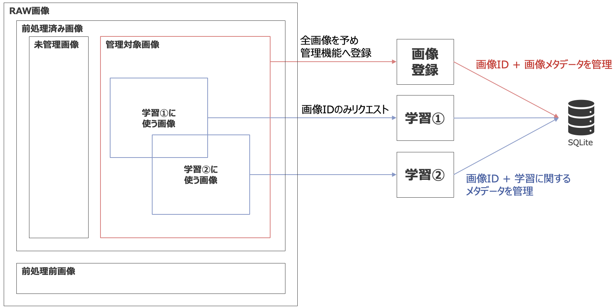

# Manage Dataset
使用するデータを管理する機能。 
学習や評価で入力したデータを後からトラッキングするためのもの。

# 機能一覧
1. データ登録
2. データ一覧取得
3. データ詳細取得
4. データ削除

# データ登録
管理対象としたデータを登録する。

# データ一覧取得
登録されたデータの一覧を取得する。

# データ詳細取得
指定したデータの詳細を取得する。

# データ除外
指定したデータを管理下から除外する。 
データ本体は削除しない。