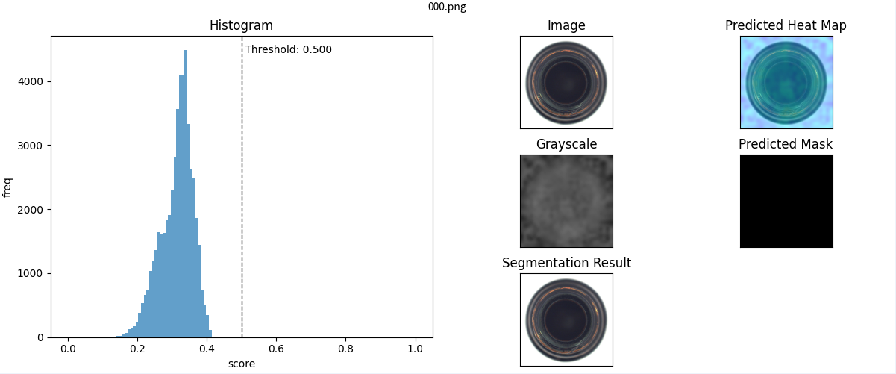
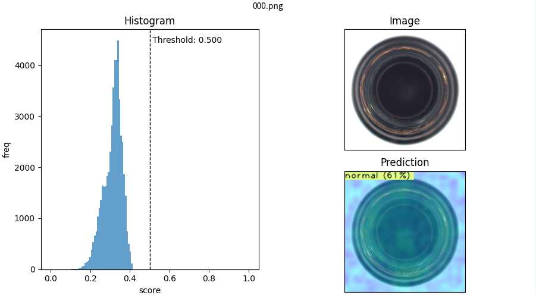

# 推論 

任意の画像を入力すると、推論により異常度のパーセンテージ（100％が異常）と推論された画像のImageScoreが出力されます。

## CUI コマンド

以下のコマンドは、推論時に現在、`hamacho`から利用可能です。


```python
@click.option(
    "--image-path", 
    type=click.Path(exists=True), required=True, 
    help="Path to image(s) to infer."
)
@click.option(
    "--config-path",
    required=True,
    type=click.Path(exists=True, dir_okay=False),
    help="Path to a config file.\n"
         "It is generally results/<product-category>/<model>/config.yaml"
)
@click.option(
    "--save-path",
    type=click.Path(exists=True, dir_okay=True),
    default=None,
    help="Path to save the output image(s)."
)
@click.option(
    "--batch-size",
    type=int,
    default=1,
    help="Inference batch size"
)
@click.option(
    "--accelerator", 
    type=str, default="auto", 
    help="You can select CPU or GPU or auto for the device."
)
@click.option(
    '--profile',
    type=click.Choice([
        "simple",
        "advanced",
        "expert",
        "custom",
    ]),
    default=None,
    help=(
        "[Only for Developers]\n"
        "simple -> only includes profiling of hamacho functions.\n"
        "advanced -> include profiling of hamacho along with libraries.\n"
        "expert -> include profiling of hamacho along with libraries and built-in functions.\n"
        "custom -> only include the defined functions and modules set in\n"
        "hamacho/core/utils/profilers/custom_profiling/functions.txt and modules.txt"
    )
)
```

## 1個のサンプルで推論する場合 

単一サンプルでテストするには、次のように行うことができます。

```python

hamacho inference --image-path "./000.png"
                  --config-path "./result/config.yaml" 
                  --save-path "./results/inference"
```
タスクタイプがセグメンテーションの場合のサンプル出力。


タスクタイプが分類の場合のサンプル出力。


## N個のサンプルで推論する場合

Tフォルダに保存された複数のサンプルでテストする場合、次のように行うことができます。

```python
hamacho inference --image-path "./bad" 
                  --config-path "results/config.yaml"
```

出力は単一と複数の両方で同じです（タスクタイプによって出力が異なります）

---


ファイル構造と結果の出力フォルダのモックセットアップは次のようになります。


```bash
root
│ 
├── data
│   ├──<category>
│       ├── good
│       │   ├── [SOME GOOD IMAGE]
│       ├── bad
│       │   ├── [SOME BAD IMAGE]
│       ├── mask [optional]
│           ├── [SOME MASK LABEL IMAGE W.R.T BAD IMAGE]
├── results
│   ├──<category>
│       ├──<model name>
│           ├── inference
│           │   │
│           │   ├── images
│           │   │   ├── combined(histgram and result images)
│           │   │   │        ├── image-path name
│           │   │   │             ├── [SOME RESULT IMAGE]
│           │   │   │   
│           │   │   ├── grayscale(Image score per pixel)
│           │   │   │        ├── image-path name
│           │   │   │             ├── [SOME RESULT IMAGE]
│           │   │   │   
│           │   │   ├── predicted_heat_map(Show anomaly)
│           │   │   │        ├── image-path name
│           │   │   │             ├── [SOME RESULT IMAGE]
│           │   │   │   
│           │   │   ├── predicted_mask(Mask GrayScale image)
│           │   │   │        ├── image-path name
│           │   │   │             ├── [SOME RESULT IMAGE]
│           │   │       
│           │   ├── csv(Image score text per pixel)
│           │   │       ├── [SOME RESULT csv file]
│           │   │
│           │   ├── metrics(Predict result,Predict file name...etc )
│           │           ├── test_outputs.csv
```

そして、定量的な平均結果。ピクセルレベルの結果は、CUI引数から`with-mask-label`オプションを有効にした場合にのみ利用可能です。 

|     |  Test metric  | DataLoader 0       |
| --- | :-----------: | :------------------: |
||     Image Level AUROC       |          1.0|
||Image Level BinaryAccuracy   |  0.9848484992980957|
||Image Level BinaryPrecision  |          1.0|
|| Image Level BinaryRecall    |  0.9841269850730896|
||    Image Level F1Score      |          1.0|
||     Pixel Level AUROC       |  0.9528321623802185|
||Pixel Level BinaryAccuracy   |  0.9129900336265564|
||Pixel Level BinaryPrecision  |  0.4540739953517914|
|| Pixel Level BinaryRecall    |  0.9793243408203125|
||    Pixel Level F1Score      |  0.6204635500907898|