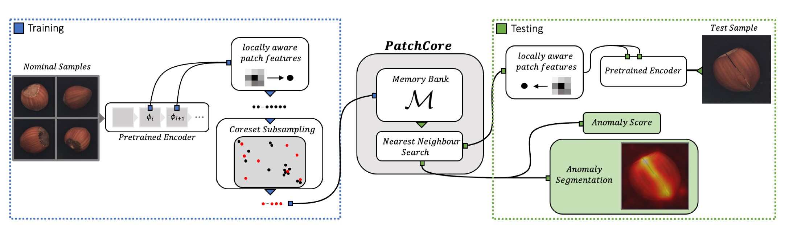
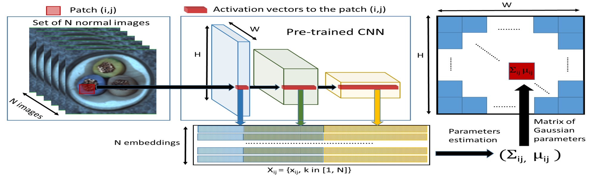

# モデルの管理

サポートされるモデルのリストです。

## [Patchcore](https://arxiv.org/pdf/2106.08265.pdf)

PatchCoreアルゴリズムは、単一のパッチが異常であると分類された時点で、画像を異常として分類できるという考えに基づいています。入力画像はタイル状に分割され、これらのタイルはニューラルネットワークに送信されるパッチとして機能します。単一の事前学習済みネットワークが構築され、中間層のパッチの特徴を抽出するために使用されます。ここで「中間層」とは、ニューラルネットワークモデルの特徴抽出層を指します。下位レベルの特徴は一般的に広すぎ、上位レベルの特徴はモデルが学習されたデータセットに固有のものです。訓練フェーズで抽出された特徴は、近傍感知パッチレベル特徴のメモリバンクに保存されます。

推論時には、このメモリバンクがコアセットサンプリングされます。コアセットサンプリングにより、利用可能なセットの構造を最も近似するサブセットが生成され、近似的な解の発見が可能になります。このサブセットは、最近傍探索に関連する検索コストを削減するのに役立ちます。異常スコアは、テストパッチコレクション内のテストパッチとそれぞれの最近傍点との間の最大距離として取得されます。



### Backbones

このモデルは、デフォルトでは1つのモデル（a）をサポートしています。`wide-resnet-50-2`（論文から選択）がデフォルトのバックボーンとして、このモデルの構成ファイル（`yaml`）にハードコーディングされています。次のモジュールでも同様です。

```python
# hamacho/plug_in/models/patchcore/torch_model.py 
class PatchcoreModel(DynamicBufferModule, nn.Module):
    """Patchcore Module."""

    def __init__(
        self,
        input_size: Tuple[int, int],
        layers: List[str],
        backbone: str = "wide_resnet50_2",
```

`torchvision.models`から他のモデルをバックボーンとして読み込むこともできます。

```python
# hamacho/plug_in/models/patchcore/torch_model.py 
class PatchcoreModel(DynamicBufferModule, nn.Module):
    """Patchcore Module."""

    def __init__(
        self,
        input_size: Tuple[int, int],
        layers: List[str],
        backbone: str = "wide_resnet50_2",
        num_neighbors: int = 9,
    ) -> None:
        super().__init__()
        self.tiler: Optional[Tiler] = None

        self.backbone = getattr(torchvision.models, backbone)
```

### レイヤー

レイヤーは通常、バックボーン全体の低レベルから中レベルのレイヤーから選択されます。高レベルの特徴はImageNetのようなパターンを示すため、使用されません。

```yaml
# hamacho/plug_in/models/patchcore/config.yaml
layers:
    - layer2
    - layer3
```

**制限事項**: PatchCoreは、特定の問題ドメインに特化する必要がなく、産業用異常検出に高い効果を発揮する一方、転移学習を利用して事前学習された特徴の転移性によって一般的に適用範囲が限定されます。この問題に対処するためには、PatchCoreの効果を活かしながら、利用される特徴の適応性を結合する必要があります。この興味深い拡張については、今後の研究に委ねられます。

**実装の詳細**: `Python 3.7`と`PyTorch`でモデルを実装しています。実験は`Nvidia Tesla V4 GPUs`で実行されます。`torchvision`から`ImageNet`で事前学習されたモデルと`PyTorch Image Models`リポジトリを使用しています。デフォルトでは、`PatchCore`は直接比較するために`WideResNet50`バックボーンを使用します。パッチレベルの特徴は、ブロック2と3の最終出力の特徴マップ集約から取得されます。最近傍検索と距離計算には、[`faiss`](https://github.com/facebookresearch/faiss)を使用します。論文のTable S6によると、PatchCoreモデルのバックボーンには`residual`タイプのモデルのみが使用されました。他の新しいImageNetモデル（例：EfficientNet）をバックボーンとして使用することもできますが、実験のレベルが必要です。

---

## [Padim](https://arxiv.org/pdf/2011.08785.pdf)

PaDiMは、パッチベースのアルゴリズムです。事前に学習したCNN特徴抽出器に依存します。画像はパッチに分割され、特徴抽出器の異なる層から各パッチから埋め込みが抽出されます。異なる層からのアクティベーションベクトルを連結することで、異なる意味レベルと解像度から情報を運ぶ埋め込みベクトルが得られます。これにより、細かいグレードやグローバルな文脈をエンコードするのに役立ちます。ただし、生成された埋め込みベクトルには冗長な情報が含まれる可能性があるため、ランダム選択を使用して次元を削減します。トレーニングバッチ全体にわたって、各パッチ埋め込みに対して多変量ガウス分布が生成されます。つまり、トレーニング画像セットの各パッチに対して、異なる多変量ガウス分布があります。これらのガウス分布は、ガウスパラメータの行列として表されます。

推論中には、Mahalanobis距離を使用してテスト画像の各パッチ位置にスコアが付けられます。トレーニング中にパッチのために計算された共分散行列の逆行列を使用します。Mahalanobis距離の行列は、スコアが高いほど異常な領域を示す異常マップを形成します。



### Backbones

PaDiMは、2つのモデルをサポートしています。 (a). `res-net-18`, (b). `wide-resnet-50-2`.

```python
# hamacho/plug_in/models/padim/torch_model.py
DIMS = {
    "resnet18": {"orig_dims": 448, "reduced_dims": 100, "emb_scale": 4},
    "wide_resnet50_2": {"orig_dims": 1792, "reduced_dims": 550, "emb_scale": 4},
}
```

ただし、`torchvision.models`からモデルを読み込むこともできます。

### レイヤー

レイヤーは通常、バックボーン全体の低レベルから中程度のレイヤーから選択されます。高レベルの特徴はImageNetのようなパターンを示すため、使用されません。

```yaml
# hamacho/plug_in/models/padim/config.yaml
layers:
    - layer1
    - layer2
    - layer3
```

関連 [discussion](https://chowagiken.atlassian.net/browse/WAD-267?focusedCommentId=19283). 公式コメント [comment](https://github.com/openvinotoolkit/anomalib/discussions/684) about adding new model.

