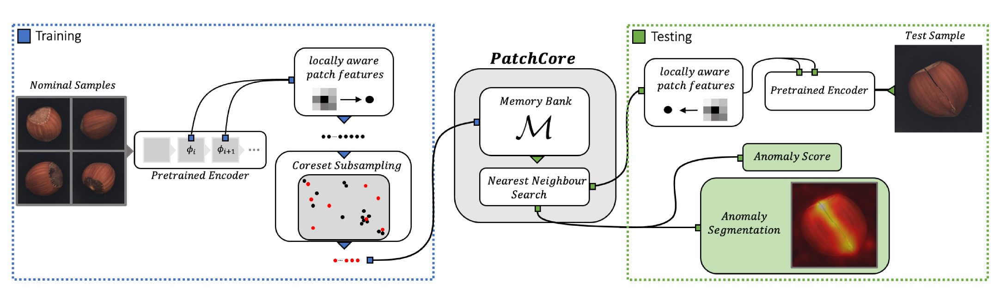

# Manage Models

List of supported models.

## [Patchcore](https://arxiv.org/pdf/2106.08265.pdf)

The PatchCore algorithm is based on the idea that an image can be classified as anomalous as soon as a single patch is anomalous. The input image is tiled. These tiles act as patches which are fed into the neural network. It consists of a single pre-trained network which is used to extract "mid" level features patches. The "mid" level here refers to the feature extraction layer of the neural network model. Lower level features are generally too broad and higher level features are specific to the dataset the model is trained on. The features extracted during training phase are stored in a memory bank of neighbourhood aware patch level features.

During inference this memory bank is coreset subsampled. Coreset subsampling generates a subset which best approximates the structure of the available set and allows for approximate solution finding. This subset helps reduce the search cost associated with nearest neighbour search. The anomaly score is taken as the maximum distance between the test patch in the test patch collection to each respective nearest neighbour.



### Backbones

This model (by default) supprt one model (a). `wide-resnet-50-2` (picked from paper). The config file (`yaml`) of this model is hard coded with this backbone. And so does the following module. 

```python
# hamacho/plug_in/models/patchcore/torch_model.py 
class PatchcoreModel(DynamicBufferModule, nn.Module):
    """Patchcore Module."""

    def __init__(
        self,
        input_size: Tuple[int, int],
        layers: List[str],
        backbone: str = "wide_resnet50_2",
```

But it is possible to load other model as backbone from `torchvision.models`.

```python
# hamacho/plug_in/models/patchcore/torch_model.py 
class PatchcoreModel(DynamicBufferModule, nn.Module):
    """Patchcore Module."""

    def __init__(
        self,
        input_size: Tuple[int, int],
        layers: List[str],
        backbone: str = "wide_resnet50_2",
        num_neighbors: int = 9,
    ) -> None:
        super().__init__()
        self.tiler: Optional[Tiler] = None

        self.backbone = getattr(torchvision.models, backbone)
```

### Layers

The layer is usually picked from low-level to mid-level layers of the whole backbone. High-level feature is denied as they exhibit ImageNet like pattern.

```yaml
# hamacho/plug_in/models/patchcore/config.yaml
layers:
    - layer2
    - layer3
```

**Limitation**: While PatchCore shows high effectiveness for industrial anomaly detection without the need to specifically adapt to the problem domain at hand, applicability is generally limited by the transferability of the pretrained features leveraged. This can be addressed by merging the effectiveness of PatchCore with adaptation of the utilized
features. We leave this interesting extension to future work.

**Implementation Detaisl**: It is implemented our models in Python 3.7 and PyTorch. Experiments are run on Nvidia Tesla V4 GPUs. It's used `torchvision` ImageNet-pretrained models from `torchvision` and the PyTorch Image Models repository. By default,`PatchCore` uses a **WideResNet50**-backbone for direct comparability. Patch-level features are
taken from feature map aggregation of the final outputs in blocks 2 and 3. For all nearest neighbour retrieval and distance computations, we use [`faiss`](https://github.com/facebookresearch/faiss). From the paper, Table S6, only `residual` type models were used as backbone for PatchCore model. For other new ImageNet models (i.e. EfficientNet) can be used as backbone, but it is needed some level of experiment.


---

## [Padim](https://arxiv.org/pdf/2011.08785.pdf)

PaDiM is a patch based algorithm. It relies on a pre-trained CNN feature extractor. The image is broken into patches and embeddings are extracted from each patch using different layers of the feature extractors. The activation vectors from different layers are concatenated to get embedding vectors carrying information from different semantic levels and resolutions. This helps encode fine grained and global contexts. However, since the generated embedding vectors may carry redundant information, dimensions are reduced using random selection. A multivariate gaussian distribution is generated for each patch embedding across the entire training batch. Thus, for each patch of the set of training images, we have a different multivariate gaussian distribution. These gaussian distributions are represented as a matrix of gaussian parameters.

During inference, Mahalanobis distance is used to score each patch position of the test image. It uses the inverse of the covariance matrix calculated for the patch during training. The matrix of Mahalanobis distances forms the anomaly map with higher scores indicating anomalous regions.


### Backbones

It supports two model, (a). `res-net-18`, (b). `wide-resnet-50-2`.

```python
# hamacho/plug_in/models/padim/torch_model.py
DIMS = {
    "resnet18": {"orig_dims": 448, "reduced_dims": 100, "emb_scale": 4},
    "wide_resnet50_2": {"orig_dims": 1792, "reduced_dims": 550, "emb_scale": 4},
}
```

But it is possible to load model from `torchvision.models`.

### Layers

The layer is usually picked from low-level to mid-level layers of the whole backbone. High-level feature is denied as they exhibit ImageNet like pattern.

```yaml
# hamacho/plug_in/models/padim/config.yaml
layers:
    - layer1
    - layer2
    - layer3
```

See this relevant [discussion](https://chowagiken.atlassian.net/browse/WAD-267?focusedCommentId=19283). Official [comment](https://github.com/openvinotoolkit/anomalib/discussions/684) about adding new model.

