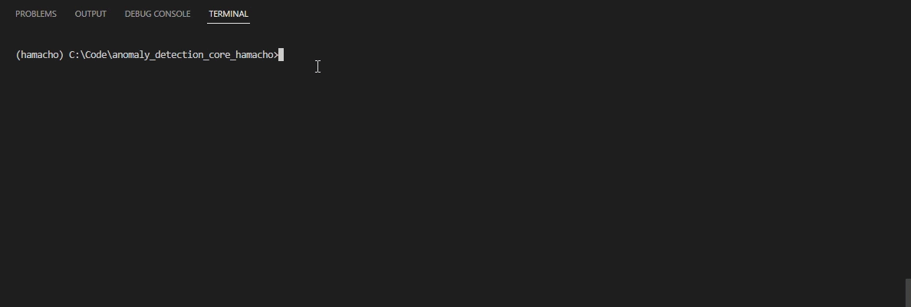

# CLI使用方法
   

*********************

# 環境構築

## pipでのインストール方法

whlファイルは[こちら](https://chowagiken.sharepoint.com/CorporatePlanning/licence-business/Shared%20Documents/Forms/AllItems.aspx?newTargetListUrl=%2FCorporatePlanning%2Flicence%2Dbusiness%2FShared%20Documents&viewpath=%2FCorporatePlanning%2Flicence%2Dbusiness%2FShared%20Documents%2FForms%2FAllItems%2Easpx&id=%2FCorporatePlanning%2Flicence%2Dbusiness%2FShared%20Documents%2F02%5F%E7%95%B0%E5%B8%B8%E6%A4%9C%E7%9F%A5%5FAnomalyDetection%2F04%5F%E3%83%97%E3%83%AD%E3%83%80%E3%82%AF%E3%83%88%E9%96%8B%E7%99%BA%5FDevelopment%2F03%5F%E9%96%8B%E7%99%BA%E6%B8%88%E3%81%BF%E6%8F%90%E4%BE%9B%E3%83%A9%E3%82%A4%E3%83%96%E3%83%A9%E3%83%AA%2Fanomaly%5Fdetection%5Fcore%5Fhamacho%2Fv1%2E4%2E0&viewid=d90a7d83%2Dbcee%2D4d76%2D8485%2D0947a8795bdc)にあります。

インストール方法  
example
```sh
pip install dist/hamacho-1.4.0-py3-none-any.whl
```

# データの準備

- [ここ](https://chowagiken.sharepoint.com/CorporatePlanning/licence-business/Shared%20Documents/Forms/AllItems.aspx?newTargetListUrl=%2FCorporatePlanning%2Flicence%2Dbusiness%2FShared%20Documents&viewpath=%2FCorporatePlanning%2Flicence%2Dbusiness%2FShared%20Documents%2FForms%2FAllItems%2Easpx&id=%2FCorporatePlanning%2Flicence%2Dbusiness%2FShared%20Documents%2F02%5F%E7%95%B0%E5%B8%B8%E6%A4%9C%E7%9F%A5%5FAnomalyDetection%2F04%5F%E3%83%97%E3%83%AD%E3%83%80%E3%82%AF%E3%83%88%E9%96%8B%E7%99%BA%5FDevelopment%2F01%5F%E8%A9%95%E4%BE%A1%E7%94%A8%E3%83%87%E3%83%BC%E3%82%BF%E3%82%BB%E3%83%83%E3%83%88%2F%E5%95%86%E7%94%A8NG%EF%BC%89mvtec%5Fbottle&viewid=d90a7d83%2Dbcee%2D4d76%2D8485%2D0947a8795bdc)からサンプルのデータセット(bottel-sealing-surface)をダウンロードしてください  
  MVTecのbottleデータを間引いたものです）

次の構造になるようにフォルダを準備してください。

```
root
│ 
├── data
│   ├──<category1>
│   │   ├── good
│   │   │    └─ [SOME GOOD IMAGE]
│   │   ├── bad
│   │   │    └─ [SOME BAD IMAGE]
│   │   └── mask [optional]
│   │        └─ [SOME MASK LABEL IMAGE W.R.T BAD IMAGE]
│   │ 
│   ├──<category2>
│   │   ├── good
│   │   ├── bad
│   │   └── mask [optional]
```

# 学習
次のステップで学習が行われます
1. data- category-good内にある正常画像を使って異常検知モデルを生成します。
   - この時、good内の画像を自動的に（学習：評価 = 8:2）に分割します。
2. 生成したモデルを使って評価もこのコマンド内で実行します。
   - goodの画像の2割とbadの画像を全て使用して評価します。
3. 学習モデルと評価結果画像は以下の**results**フォルダに出力されます。

****
学習には3つのオプションがあります
- [セグメンテーション(マスクあり)](#1-option-1)  
- [セグメンテーション(マスクなし)](#2-option-2)  
- [分類](#3-option-3)  
また正常画像のみで学習可能な[no-bad-mode](#special-condition-anomalous-samples-unavailableno-bad-mode)も用意しています。


****

### 学習後の出力  

```
root
│ 
├── data(画像データ)
│   └──<category1>
│       ├── good
│       │   └─ [SOME GOOD IMAGE]
│       ├── bad
│       │   └─ [SOME BAD IMAGE]
│       └── mask [optional]
│           └─ [SOME MASK LABEL IMAGE W.R.T BAD IMAGE]
└──results(出力結果)
    └──<category>
        └──<model name>
            ├── test_predictions
            │   │
            │   ├── images
            │   │   ├── combined(histgram and result images)
            │   │   │    └── [SOME RESULT IMAGE]
            │   │   ├── grayscale(Image score per pixel)
            │   │   │    └── [SOME RESULT IMAGE]
            │   │   ├── predicted_heat_map(Show anomaly)
            │   │   │    └── [SOME RESULT IMAGE]
            │   │   └──predicted_mask(Mask GrayScale image)
            │   │        └── [SOME RESULT IMAGE]
            │   │       
            │   ├── csv(Image score text per pixel)
            │   │        └── [SOME RESULT csv file]
            │   │
            │   └── metrics(AUROC,confusion_matrix,image-level-roc,etc)
            │            └── [SOME RESULT IMAGE and csv file]
            │           
            ├── weights
            │    └── trained_data.hmc
            │          
            └── config.yaml
```
pixel Level の出力はwith-mask-label(default False)オプションが有効の時のみ表示されます。

|     |  Test metric  | DataLoader 0       |
| --- | :-----------: | :------------------: |
||     Image Level AUROC       |          1.0|
||Image Level BinaryAccuracy   |  0.9848484992980957|
||Image Level BinaryPrecision  |          1.0|
|| Image Level BinaryRecall    |  0.9841269850730896|
||    Image Level F1Score      |          1.0|
||     Pixel Level AUROC       |  0.9528321623802185|
||Pixel Level BinaryAccuracy   |  0.9129900336265564|
||Pixel Level BinaryPrecision  |  0.4540739953517914|
|| Pixel Level BinaryRecall    |  0.9793243408203125|
||    Pixel Level F1Score      |  0.6204635500907898|

************


### 1. Option (1)
データにマスクラベルを持つ、学習＆評価後のセグメンテーション結果は以下の通りになります。

─────────────────────────────
### pipインストールで学習する場合
```sh
hamacho train --with-mask-label --task-type segmentation --model patchcore --category bottle-sealing-surface
```
出力結果イメージ（右側のAUROCなどのグラフは別ファイルで出力されます）


### 2. Option (2)
データにマスクラベルを持たない、学習＆テスト後のセグメンテーション結果は以下の通りになります。

### pipインストールで学習する場合
```sh
hamacho train  --task-type segmentation --model patchcore --category bottle-sealing-surface
```

出力結果イメージ（右側のAUROCなどのグラフは別ファイルで出力されます）


### 3. Option (3)
データにマスクラベルを持たない学習＆テスト後の分類の結果は以下の通りになります。

### pipインストールで学習する場合
```sh
hamacho train  --task-type classification --model patchcore --category bottle-sealing-surface
```

出力結果イメージ（右側のAUROCなどのグラフは別ファイルで出力されます）


### Special Condition: Anomalous Samples Unavailable(no-bad-mode)
 `--no-bad-mode`の引数を追加することで、[segmentation /セグメンテーション(マスクなし)](#2-option-2) and [classification/分類](#3-option-3) を正常画像のみ(good)で学習させることが可能です。

- 以下のデータ構造を準備して下さい:
  ```
  data
  └── <product category>
      │
      └── good
          └── [SOME GOOD IMAGE]
  ```
- 学習:
  
  ```sh
  hamacho train --task-type [segmentation/classification] --model [patchcore/padim] --category bottle-with-no-bad --no-bad-mode
  ```

# 推論
*****
推論は任意の画像を入力すると、その画像に対しての異常度のパーセンテージ（100％が異常）と推論した画像のImageScoreが出力されます。

*****

```
root
│ 
├── data(画像データ)
│   └──<category>
│       ├── good
│       │   ├── [SOME GOOD IMAGE]
│       ├── bad
│       │   ├── [SOME BAD IMAGE]
│       └── mask [optional]
│           └── [SOME MASK LABEL IMAGE W.R.T BAD IMAGE]
└── results(出力結果)
   └──<category>
       └──<model name>
           └── inference
               │
               ├── images
               │   ├── combined(histgram and result images)
               │   │        └── image-path name
               │   │             └── [SOME RESULT IMAGE]
               │   │   
               │   ├── grayscale(Image score per pixel)
               │   │        └── image-path name
               │   │             └── [SOME RESULT IMAGE]
               │   │   
               │   ├── predicted_heat_map(Show anomaly)
               │   │        └── image-path name
               │   │             └── [SOME RESULT IMAGE]
               │   │   
               │   └── predicted_mask(Mask GrayScale image)
               │            └── image-path name
               │                 └── [SOME RESULT IMAGE]
               │       
               ├── csv(Image score text per pixel)
               │       └── [SOME RESULT csv file]
               │
               └── metrics(Predict result,Predict file name...etc )
                       └── test_outputs.csv
```

推論は２つのオプションがあります。
- [ファイル1つを推論](#一つのデータを推論する場合)  
- [フォルダ内の画像を全て推論](#フォルダ内の画像を全て推論する場合)  

## 一つのデータを推論する場合

### pipインストールで推論する場合
```sh
hamacho inference --image-path "data/bottle-sealing-surface/000.png" \
                         --config-path "./results/bottle-sealing-surface/patchcore/config.yaml" \
                         --save-path "./results/infer"
```

## フォルダ内の画像を全て推論する場合

### pipインストールで推論する場合
```sh
hamacho inference --image-path "data/bottle-sealing-surface/bad" --config-path "results/bottle-sealing-surface/patchcore/config.yaml"
```

result：
単体でも複数でも出力物は同じ（タスクタイプによって出力は変わる）  

セグメンテーションの出力結果


分類の出力結果　（ImageScore<0.5が正常）


## 閾値の変更(Control Threshold)
画像に対しての閾値(image_norm)はdefault値は0.5より小さいと正常、0.5以上を異常としている。config.yaml内に以下のパラメータがあり、ここを調整することで正常・異常の閾値をあとから変更することができる。  

segmentationの場合は各画素の閾値(pixel_norm)をコントロールすることでマスクの値を変更することが可能。  

```yaml
  threshold:                    threshold:
    image_norm: 0.5       →       image_norm: 0.5
    pixel_norm: 0.5       →       pixel_norm: 0.9
    image_default: 0      →       image_default: 0
    pixel_default: 0      →       pixel_default: 0
    adaptive: true        →       adaptive: true
```


---


# Argument-list(引数一覧)
## train  
学習に使う引数
Usage：Usage: main.py train [OPTIONS]  

| 必須<br>required | 引数<br> argument | 型<br>type | 備考<br>mark                                                                                                                                                                                                             |
| ---------------- | :---------------: | ---------- | ------------------------------------------------------------------------------------------------------------------------------------------------------------------------------------------------------------------------ |
| 〇               |    --category     | TEXT       | Name of the product category in the dataset root folder                                                                                                                                                                  |
| ×                |      --model      | TEXT       | Name of the algorithm to train/test<br>[default] patchcore<br>[select] patchcore or padim                                                                                                                                |
| ×                |   --result-path   | TEXT       | Path to save the results<br>[default]　./result                                                                                                                                                                          |
| ×                |    --task-type    | TEXT       | Whether modeling as classificaiton or segmentation approach.<br>[default] segmentation <br>[select] classificaiton or segmentation                                                                                       |
| ×                | --with-mask-label | BOOLEAN    | We can train model with or without ground truth mask. <br>[default] False                                                                                                                                                |
| ×                |   --accelerator   | TEXT       | You can select cpu or gpu or auto for the device.<br>[default] auto                                                                                                                                                      |
| ×                |  --dataset-root   | PATH       | Directory of the dataset root folder  <br>[default] ./data                                                                                                                                                               |
| ×                |   --data-format   | TEXT       | Name of dataset format of the <product category> in the dataset root directory  <br>[default] folder  <br>[select] folder or mvtec                                                                                       |
| ×                |   --image-size    | INTEGER    | Image size of the training images in pixels. The value must be divisible by 32 and within 64 and 640. <br> [default] None (means the training will be done in the default image size value set in the model config file) |
| ×                |   --batch-size    | INTEGER    | Batch size of train and test dataloader. The value must be greater than 0. <br> [default] None (means the batch size value set in the model config file will be used)                                                    |
| ×                |   --num-workers   | INTEGER    | Number of cpu processes that the data loader can use. Linux,MacOS only use <br>[default] 0                                                                                                                                                    |
| ×                |      --split      | FLOAT      | Percentage of train set images that will be used for test set. Must be within 0.01 and 0.99. <br>[default] 0.2                                                                                                           |
| ×                |      --seed       | INTEGER    | Seed value to control dataset random split <br>[default] 420                                                                                                           |
| ×                |   --config-path   | PATH       | [Expert Only] Edited config path of model config.yaml file <br>[default] None (means model config will be loaded automatically from --model arg)                                                                                                           |
| ×                |   --no-bad-mode   | BOOLEAN       | Select this when only good data is available <br>[default] False                                                                                                           |


## 推論に使う引数

Usage：Usage: main.py inference [OPTIONS]

| 必須<br>required | 引数<br> argument | 型<br>type | 備考<br>mark                                                                                  |
| ---------------- | :---------------: | ---------- | --------------------------------------------------------------------------------------------- |
| 〇               |   --image-path    | PATH       | Path to image(s) to infer.[required]                                                          |
| 〇               |   --config-path   | TEXT       | Path to a config file  [required]<br>[default] results/<product_category>/<model>/config.yaml |
| ×                |    --save-path    | TEXT       | Path to save the output image(s).<br>[default] inference                                      |
| ×                |  --batch-size   | INTEGER    | Inference batch size.                                 |
| ×                |   --accelerator   | TEXT       | You can select cpu or gpu or auto for the device.<br>[default] auto                           |


## ユニット/統合テスト

すべてのテスト ケースを実行するには:

```bash
{projecy-root}: pytest tests/ --disable-pytest-warnings
# or
{projecy-root}: python -m pytest tests/ --disable-pytest-warnings
```

個々の機能をテストするには:

```bash
{project-root}: pytest <path-to-py-file> --disable-pytest-warnings
                # example
                # pytest tests/integration/train/test_train_model.py --disable-pytest-warnings
```

#### テスト カバレッジ レポートの生成

テスト カバレッジ レポートを生成するには:

```bash
{project-root}: pytest --cov-report=html:coverage-report --cov=hamacho tests/ --disable-pytest-warnings
```
上記のコマンドは、coverage-report という名前のフォルダーを生成します。 
カバレッジレポートを開く


[Quick Start Guideに戻る](quickstart.jp.md)