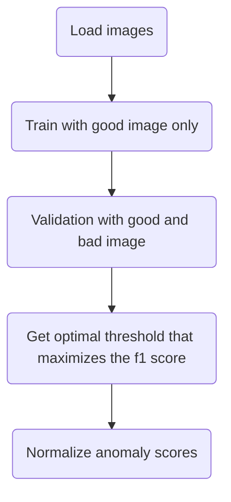
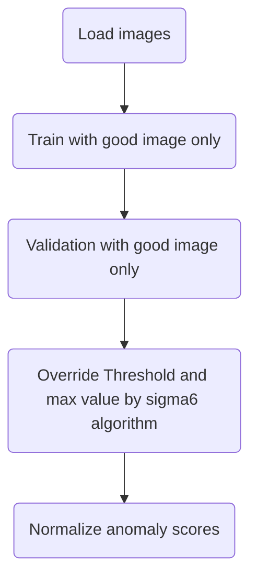

# Sigma6 Method(No-bad-mode)

## 背景

多くの産業現場では、正常画像を取得するのは簡単だが、異常画像を全てのパターンを取得するのはコストがかかり複雑である。  
異常検出は、モデルが学習データの分布から引き出されたサンプルとそのサポート外のサンプルを区別する、分布外検出問題として投げかけられます。

常のトレーニングでは、検証中に異常検出の F1 スコアを最大化し、スコアを  `[0, 1]`に正規化するしきい値が選択されます。これを通常 (ケース:0) と見なします。全体的なプロセスのフローチャートを以下に示します。

しかしながら、`no-bad-mode` では、正常画像のみあるため、最適な閾値値とその後の正規化を決定するための異常画像が存在しません。  
これを解決するために、統計学の [3σ ルール]((https://en.wikipedia.org/wiki/68%E2%80%9395%E2%80%9399.7_rule#:~:text=In%20the%20empirical%20sciences%2C%20the,99.7%25%20probability%20as%20near%20certainty.))を着想に得た`Sigma6` アルゴリズムが導入されました。

## Sigma6 Algorithm
- N個の正常画像の異常スコア $s_1, s_2, ..., s_N \in \mathbb{R}$ of $N$ に対して、`異常スコアの平均`と`標準偏差`を取り、以下のように閾値を設定します。:

$$
threshold = mean + 3 * std
$$

- 観察された最大異常スコア $mx$ を乗数$multiplier$ `(default=2)` で上書きし、未知の異常画像の異常スコアが `[threshold, mx]`の範囲内にあると仮定します。観察された最小異常スコア, $mn$ はそのままにしておきます。

$$
mx = threshold * multiplier
$$

- その後、異常スコアは、以下のように最小最大正規化されます:

$$
s_{norm} = ((s_i - threshold) / (mx - mn)) + 0.5
$$

$$
s_{norm} = max(0, min(s_{norm}, 1))
$$
    
$s_{i}$ が画像レベルの異常スコアであり $s_{norm}$ が正規化された異常スコアです。

これを`no-bad-mode`と定義します。フローチャートを以下に示します:

