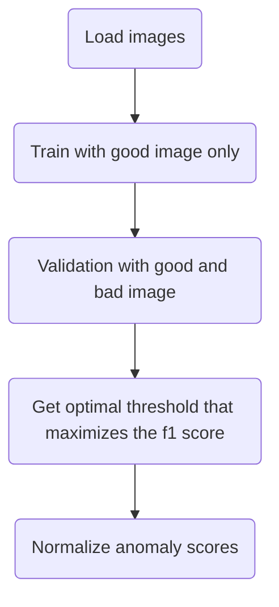
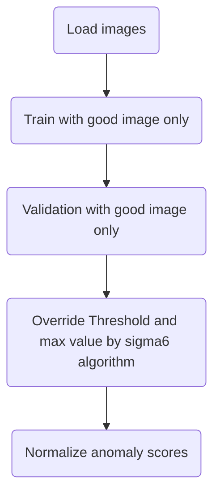

# Sigma6 Method(No-bad-mode)

## Background

It arises in many industrial scenarios where it is easy to acquire imagery of normal examples but costly and complicated to specify the expected defect variations in full. So the task of anomaly detection is naturally cast as an out-of-distribution detection problem where a model needs to distinguish between samples being drawn from the training data distribution and those outside its support.

For regular training, a threshold is selected that maximizes F1-score for anomaly detection during validation and then normalizes the score to `[0, 1]`. We consider this to be regular(case:0). A flowchart of the overall process is shown below:

However, in `no-bad-mode` we do not have any anomalous sample to base our optimal threshold value and subsequent normalization. To resolve this Sigma6 algorithm was introduced which is inspired by the [3σ rule](https://en.wikipedia.org/wiki/68%E2%80%9395%E2%80%9399.7_rule#:~:text=In%20the%20empirical%20sciences%2C%20the,99.7%25%20probability%20as%20near%20certainty.) of statistics.

## Sigma6 Algorithm
- For image-level anomaly scores $s_1, s_2, ..., s_N \in \mathbb{R}$ of $N$ validation(good) images, take the mean and standard deviation of their anomaly scores and override the threshold as below:

$$
threshold = mean + 3 * std
$$

- Override the observed maximum anomaly score, $mx$ with a multiplier, $multiplier$`(default=2)` assuming the anomaly scores of the unseen anomalous samples will be in the range `[threshold, mx]`. Observed minimum anomaly score, $mn$ is kept as it is.

$$
mx = threshold * multiplier
$$

- Anomaly scores are then normalized with min-max normalization as below:

$$
s_{norm} = ((s_i - threshold) / (mx - mn)) + 0.5
$$

$$
s_{norm} = max(0, min(s_{norm}, 1))
$$
    
where $s_{i}$ is image-level anomaly score and $s_{norm}$ normalized anomaly score.

We consider this to be no-bad-mode(case:1). The flowchart for this is shown below:

