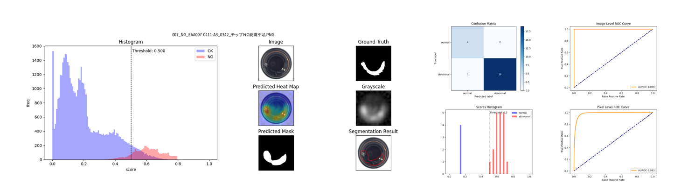
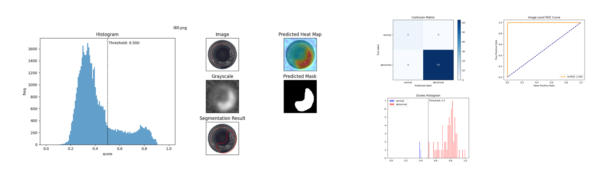
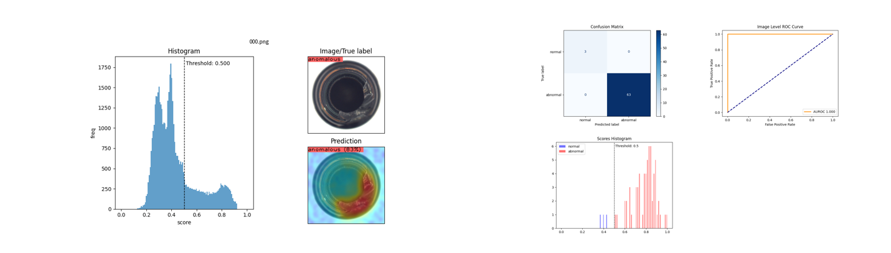

# Training

Generate an anomaly detection model using normal images of data category. This command also runs the tests at the same time using the model generated at the same time. Images of the learning model and test results are output to the results folder below.

## CUI Commands

The following commands are currently available from `hamacho` product during training.

```python
@click.option(
    "--model", 
    type=str, default="patchcore",
    help="Name of the algorithm to train/test"
)
@click.option(
    "--dataset-root", 
    type=click.Path(exists=True, dir_okay=True), default=None,
    help="Path consisting the datasets"
)
@click.option(
    "--result-path", 
    type=str, default="./results",
    help="Path to save the results"
)
@click.option(
    "--task-type", 
    type=click.Choice(("classification", "segmentation")),
    default="segmentation", 
    help="Whether modeling as classification or segmentation approach."
)
@click.option(
    "--with-mask-label", 
    default=False, is_flag=True, 
    help="We can train model with or without ground truth mask."
)
@click.option(
    "--accelerator", 
    type=click.Choice(("cpu", "gpu", "auto")),
    default="auto", 
    help="You can select cpu or gpu or auto for the device."
)
@click.option(
    "--image-size",
    type=ImageSizeRange(), default=None,
    help="Image size of the training images in pixels"
)
@click.option(
    "--batch-size",
    type=BatchSizeType(),
    default=None,
    help="train test batch size"
)
@click.option(
    "--split",
    type=TrainTestSplitType(),
    default=0.2,
    help="train val test split percentage in float"
)
@click.option(
    "--data-format",
    type=click.Choice(("folder", "mvtec", "filelist")),
    default="folder",
    help="format of the dataset in `data/` folder"
)
@click.option(
    "--category",
    type=str,
    required=True,
    help="name of the product in `data/` folder"
)
@click.option(
    "--num-workers",
    type=NumWorkersType(), default=0, hidden=hide_nw,
    help="Number of workers for the dataloader to use"
)
@click.option(
    "--good-file-list",
    type=str,
    help="list of good files"
)
@click.option(
    "--bad-file-list",
    type=str,
    help="list of bad files"
)
@click.option(
    "--mask-file-list",
    type=str,
    default=None,
    help="list of mask files"
)
@click.option(
    "--config-path",
    type=click.Path(exists=True, dir_okay=False),
    default=None,
    help=(
        "[Expert Only]\n"
        "Edited config path of model config.yaml file"
    )
)
@click.option(
    "--seed",
    type=int, default=420,
    help="Seed value to control dataset random split"
)
@click.option( 
    "--no-bad-mode",
    default=False, is_flag=True,
    help="Select this when only good data is available" 
)
```


## Segmentation with Binary Mask

The segmentation result after learning & testing with mask labels on the test data is as follows.

```python
hamacho train --with-mask-label 
              --task-type segmentation 
              --model patchcore 
              --category bottle-sealing-surface
```
sample output


## Segmentation without Binary Mask

```python
hamacho train --task-type segmentation 
              --model patchcore 
              --category bottle-sealing-surface
```
sample output


## Classification

```python
hamacho train  --task-type classification 
               --model patchcore 
               --category bottle-sealing-surface
```
sample output



## Special Condition: Anomalous Samples Unavailable(no-bad-mode)
Segmentation and classification can be run when only nominal(good) samples are available with `--no-bad-mode` flag.

- Prepare the data in following structure:
  ```
  data
  ├── <product category>
  │   │
  │   ├── good
  │   │   ├── [SOME GOOD IMAGE]
  ```
- Train:
  ```sh
  $ hamacho/main.py train --task-type [segmentation/classification] --model [patchcore/padim] --category bottle-with-no-bad --no-bad-mode
  ```

Please see [here](manage-training-no_bad_mode.md) for detailed explanation of the No-bad-mode algorithm.